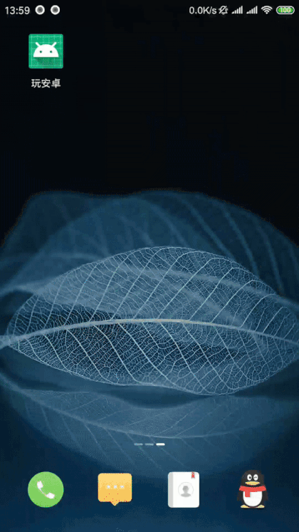

# wanandroid_java
wanandroid_java is an android client for [wanandroid open API](http://wanandroid.com/blog/show/2;jsessionid=34FDD3E17997A155785691CF962ADD95). And it`s a practice for [Android JetPack](https://developer.android.com/jetpack/).

# Preview

# Features

- Data driven UI: [dataBinding](https://developer.android.com/topic/libraries/data-binding/)
- Data holds the view state: [ViewData](lib_repository/src/main/java/com/yuloran/lib_repository/viewdata/BaseViewData.java)
- Lifecycle aware components: [RxFragment](https://github.com/trello/RxLifecycle), [ViewModel](https://developer.android.com/topic/libraries/architecture/viewmodel), [LiveData](https://developer.android.com/topic/libraries/architecture/livedata)
- Convenient DataBase: [Room](https://developer.android.com/training/data-storage/room/)
- Migrate to [androidx.*](https://developer.android.com/jetpack/androidx/?hl=zh-cn)

# Architecture

- [MVVM](https://en.wikipedia.org/wiki/Model%E2%80%93view%E2%80%93viewmodel)
- Develops in individual module
- [Client/Server design pattern](lib_core/src/main/java/com/yuloran/lib_core/init) for components initialization

# Public Utils

**Avoid NullPointerExceptions**

- [ArrayUtil](lib_core/src/main/java/com/yuloran/lib_core/utils/ArrayUtil.java)
- [SafeBroadCastReceiver](lib_core/src/main/java/com/yuloran/lib_core/template/nullsafe/SafeBroadCastReceiver.java)

**Work around [LiveData](https://developer.android.com/topic/libraries/architecture/livedata) bugs**

- [SingleLiveEvent](lib_core/src/main/java/com/yuloran/lib_core/template/SingleLiveEvent.java)
- [SafeMutableLiveData](lib_core/src/main/java/com/yuloran/lib_core/template/threadsafe/SafeMutableLiveData.java)

**Singleton design pattern template**

- [Singleton](lib_core/src/main/java/com/yuloran/lib_core/template/Singleton.java)
- [Singleton1](lib_core/src/main/java/com/yuloran/lib_core/template/Singleton1.java)

**Resource Util**

- [ResUtil](module_base/src/main/java/com/yuloran/module_base/util/ResUtil.java)

**Extensions for [MultiTypeAdapter](https://github.com/drakeet/MultiType)**

- [ViewHolder for dataBinding](module_base/src/main/java/com/yuloran/module_base/ui/adapter/recyclerview/databinding)
- [Load more](module_base/src/main/java/com/yuloran/module_base/ui/adapter/recyclerview/loadmore)
- [OnItemClickLienter for dataBinding](module_base/src/main/java/com/yuloran/module_base/ui/adapter/recyclerview/OnItemClickListener.java)
- [MultiTypeAdapterEx](module_base/src/main/java/com/yuloran/module_base/ui/adapter/recyclerview/MultiTypeAdapterEx.java)

**[GIF Compress Website](https://ezgif.com/maker)**
